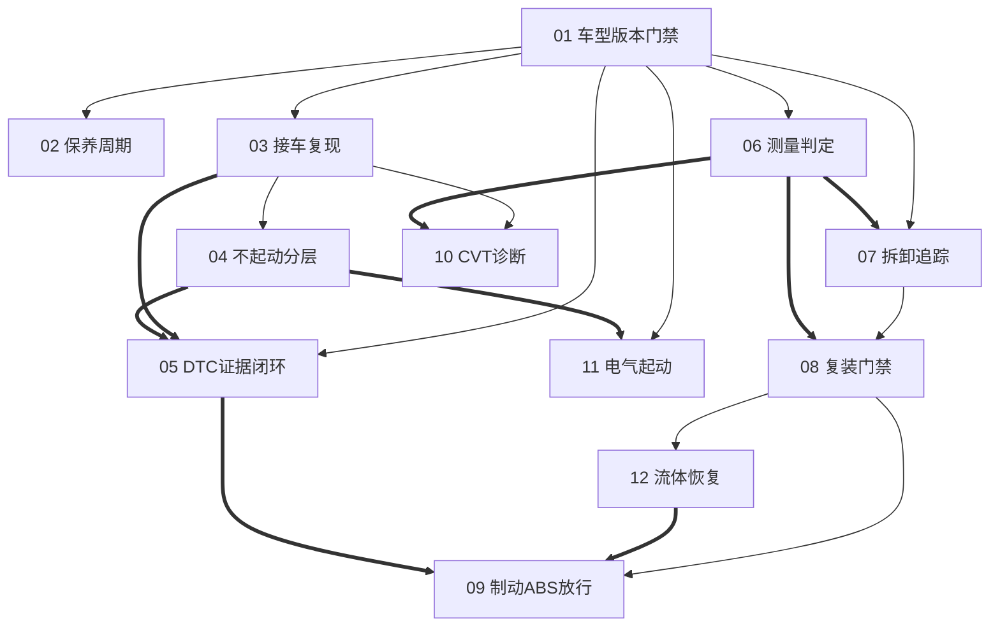

# 钱江、凯越、升仕官方维修手册合集 — 技师能力索引

> 由 41 份官方技师资料、11,234 页原文蒸馏为 **12 个可执行能力模块**。处理时间：2026-09-11。

## 关于资料集

- **发布者**：钱江摩托、凯越机车、升仕摩托
- **资料年份**：不同车型版本混合；当前整理于 2026 年
- **一句话主旨**：从“看手册找答案”升级为“先确认资料资格，再按证据链诊断、测量、拆装和验收”。
- **整库理解**：[BOOK_OVERVIEW.md](./BOOK_OVERVIEW.md)
- **来源目录与哈希**：[SOURCE_CATALOG.md](./SOURCE_CATALOG.md)
- **共享术语**：[GLOSSARY.md](./GLOSSARY.md)
- **阶段5精华学习稿**：[DIGEST.md](./DIGEST.md)（阶段5生成）
- **职业标准基础知识**：[电工电子](./foundation-basics/01_ELECTRICAL_ELECTRONICS.md) · [常用材料](./foundation-basics/02_MATERIALS.md) · [液压传动](./foundation-basics/03_HYDRAULICS.md) · [摩托车构造](./foundation-basics/04_MOTORCYCLE_CONSTRUCTION.md)（职业编码 4-12-01-02）
- **扩展学习中心**：[维修学习路线](./external-learning/REPAIR_LEARNING.md) · [摩托车设计路线](./external-learning/MOTORCYCLE_DESIGN.md) · [维修工具图鉴](./external-learning/WORKSHOP_TOOLS.md) · [ADV、踏板与仿赛车型专项](./external-learning/RIDER_TYPE_MODULES.md)
- **原始来源中文精编课**：[维修、设计与工具三编合订本](./external-learning/translated-course-zh/translation.md)（23 个来源已逐项归类）
- **外部来源政策**：[SOURCE_POLICY.md](./external-learning/SOURCE_POLICY.md)（只保存链接、元数据与原创摘要，不搬运受版权保护正文）

## 模块列表

### A. 接车与计划

- [`motorcycle-model-version-gate`](./01-model-version-gate/SKILL.md) — 核实手册数据是否适用于当前实车。
- [`motorcycle-maintenance-interval-planner`](./02-maintenance-interval-planner/SKILL.md) — 按时间、里程与工况制定保养计划。
- [`motorcycle-symptom-evidence-intake`](./03-symptom-evidence-intake/SKILL.md) — 把模糊口述转成可复现故障事件。

### B. 故障诊断

- [`motorcycle-no-start-state-diagnosis`](./04-no-start-state-diagnosis/SKILL.md) — 区分不转、转不着、着即熄和动力不传递。
- [`motorcycle-dtc-evidence-loop`](./05-dtc-evidence-loop/SKILL.md) — 把故障码变成线路、元件与复验的证据闭环。
- [`motorcycle-cvt-drivetrain-diagnosis`](./10-cvt-drivetrain-diagnosis/SKILL.md) — 踏板CVT症状到传力链区段的映射。
- [`motorcycle-power-starting-electrical`](./11-power-starting-electrical/SKILL.md) — 亏电、充电、起动负载与联锁的分层诊断。

### C. 拆检、测量与复装

- [`motorcycle-measurement-decision-engine`](./06-measurement-decision-engine/SKILL.md) — 标准值、维修极限、最不利值与配合归因。
- [`motorcycle-disassembly-traceability`](./07-disassembly-traceability/SKILL.md) — 拆前取证、分格编号和配对件身份链。
- [`motorcycle-reassembly-quality-gates`](./08-reassembly-quality-gates/SKILL.md) — 清洁换新、润滑、顺序定扭和静态验收。

### D. 安全系统与完工放行

- [`motorcycle-brake-abs-release-gate`](./09-brake-abs-release-gate/SKILL.md) — 基础制动、液压、ABS与动态复验。
- [`motorcycle-closed-fluid-system-recovery`](./12-closed-fluid-system-recovery/SKILL.md) — 燃油、冷却和制动开路后的安全恢复。

## 能力关系图

图例：`-->` 表示前置依赖，`==>` 表示经常组合使用。04与10/11还承担状态分流：发动机能否转动、能否着车、动力是否传到车轮决定进入哪个模块。

## 学徒推荐学习路线

1. **职业基础**：电工电子 → 常用材料 → 液压传动 → 摩托车构造
2. **资料与工单基础**：01 → 02 → 03
3. **通用诊断思维**：04 → 05 → 11
4. **尺寸与拆装基本功**：06 → 07 → 08
5. **车型专项**：钱江/升仕踏板重点学10；巡航与ADV重点巩固11
6. **高风险系统**：12 → 09，必须在师傅监督和原手册数值约束下实操

每学一个模块，按“读方法 → 做空车/废件练习 → 在师傅监督下做一单 → 用工单复盘”的节奏推进。任何扭矩、间隙、燃压和维修极限都应回查对应车型原 PDF。

## 审计轨迹

- [阶段1候选池](./candidates/)
- [三重验证结果](./verified.md)
- [降级提案与理由](./rejected/)
- [58个方法候选去向](./CANDIDATE_DISPOSITION.md)
- [流水线状态](./PIPELINE_STATE.md)
